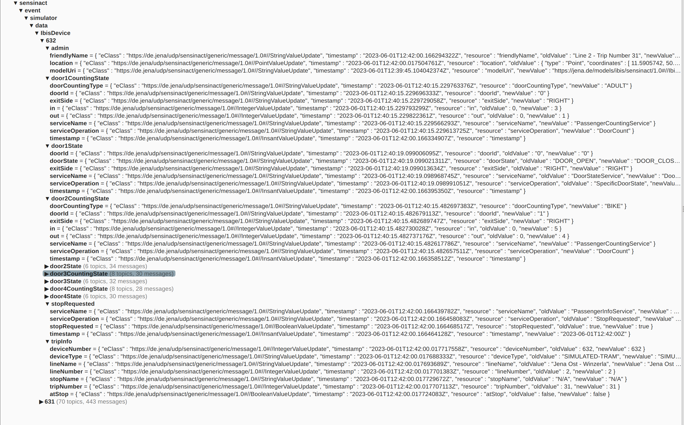

# Ibis Simulator

## How is it built?

The simulator is based on a sample tram line 2 (Jena Ost - Winzerla). The tram line object is built accordingly to the `de.jena.udp.trafficos.publictransport.model` and is saved in the db, if it does not exist yet.

The simulated tram line timetable is built based on the following underlined schedule:

We considered the four tram trips every hour, from 7am to 6pm, but enlarged the range till 8pm for the simulation.

## How does it work?

Once started, the simulator checks every minute, depending on the time of day, which tram trips are currently running and takes them into account.

Then it checks whether a tram trip should be at a stop or in between stops:

+ If it is at a stop, several messages are generated:
  + a **GEO_INFO** message, with the current location of the tram;
  + a **DOOR_CHANGE** message, one for each door (assuming every tram has 4 doors per each side), to inform that a door has been opened;
  + a **DOOR_COUNT** message, one for each door, which randomly generate a type and a counting number for the passengers going into and out of the tram (if the randomly generated `in` and `out` are both equal to zero, no message is sent);
  + a **DOOR_CHANGE** message again, one for each door, to inform that a door has been closed. These are sent with a delay of 3 seconds from the other messages, to simulate the time the doors stay open.
+ If NOT at a stop, a **STOP_REQUESTED** message is generated, with a probability of 50%, to simulate the possibility that a passenger presses the button. 

All these messages are sent over MQTT to our dim-full broker, with a topic of `public/transport/data/entry/<timeTableRef>/<dataValueType>`, where `timeTableRef` is just a number from 0 to 47, which identifies the trip (the trip starting at 7:03 in the morning is the number 0, while the one starting at 18:33 in the evening is number 47). The `dataValueType` is the type of message sent (`GEO_INFO`, `DOOR_CHANGE`, etc).

## How data are pushed to SensiNact?

The `IbisSensinactMqtt` component subscribes to the topic and, after applying the mmt transformations pushes the `IbisDevice` to SensiNact. 

SensiNact publishes the data to the `DATA/*` topic through the `EventAdmin`, so we have an additional `TypedEventHandler` which republish the data via MQTT to our dim-full broker.

An example of the published results is:

The topic looks like `5g/sensinact/event/simulator/data/IbisDevice/<tramLineId>-<timeTableRef>/...`, where the `tramLineId` is the id with which the tram line is saved in the db. In our case we only have the tram line 2, so this id is always the same. The `timeTableRef` is again the reference to the trip of the day, so you can distinguish from which actual trip the update came from.

## How to run the whole thing?

A docker image has been created and it's available at `registry-git.jena.de/scj/ibis-simulator:latest`.

In the root folder of the project there is a `docker-compose/prod` folder, which contains already a `docker-compose.yml` to pull the image and run a container.

The only thing that needs to be done is to complete the settings of the two `.env` files, one for mongodb and one for the mqtt configurations, which are located as well in the `docker-compose/prod` folder.

Once the app is up and running, the simulation starts immediately. 

To check the status of the simulator, and, in case, to stop and start it again, 3 endpoints are available under:

+ `http://localhost:8080/simulator/rest/running`: returns whether the simulator is currently running or not;
+ `http://localhost:8080/simulator/rest/stop`: stop the simulator;
+ `http://localhost:8080/simulator/rest/start`: start the simulator.